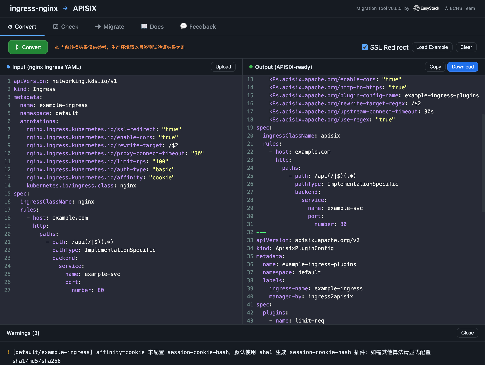

# ingress2apisix

> 语言切换: [English](README.md) | **中文**

`ingress2apisix` 是一个将 nginx Ingress 资源迁移到 APISIX Ingress Controller 的工具，支持文件转换、集群 apply、Helm Chart 扫描/迁移和 Web UI。

## 使用预览



## 功能

- 将 `nginx.ingress.kubernetes.io/*` 和 `ingress.kubernetes.io/*` 注解转换为 APISIX Ingress Controller 可识别的配置。
- 将 `ingressClassName` 从 `nginx` 改为 `apisix`，并移除 `kubernetes.io/ingress.class: nginx`。
- 对 APISIX 原生注解无法覆盖的能力生成 `ApisixPluginConfig`。
- 自动生成 `BackendTrafficPolicy` 支持 `affinity: cookie` 会话亲和。
- 支持自定义 Lua 插件处理 cookie hash、cookie flags、cookie path 和多区域 IDP 代理场景。
- 支持单个 Ingress、`IngressList`、Kubernetes `List` 和多文档 YAML。
- 支持直接读取集群 Ingress 并 apply 转换结果。

兼容两种 nginx 注解前缀：

- `nginx.ingress.kubernetes.io/*`
- `ingress.kubernetes.io/*`

当两种前缀同时存在时，优先使用 `nginx.ingress.kubernetes.io/*`。

## 核心转换能力

### 原生 APISIX 注解

| nginx 注解后缀 | APISIX 配置 | 说明 |
|---|---|---|
| `ssl-redirect: "true"` | `k8s.apisix.apache.org/http-to-https: "true"` | HTTP 跳 HTTPS |
| `force-ssl-redirect` | `k8s.apisix.apache.org/http-to-https: "true"` | 强制 HTTPS |
| `rewrite-target` | `rewrite-target` / `rewrite-target-regex` | 路径重写 |
| `configuration-snippet` 单条 rewrite | `rewrite-target-regex` + `rewrite-target-regex-template` | 单条 rewrite 使用原生注解 |
| `proxy-connect-timeout` | `upstream-connect-timeout` | 自动补 `s` 后缀 |
| `proxy-send-timeout` | `upstream-send-timeout` | 发送超时 |
| `proxy-read-timeout` | `upstream-read-timeout` | 读取超时 |
| `enable-cors` | `enable-cors` | CORS 开关 |
| `backend-protocol` | `upstream-scheme` | HTTP/HTTPS/GRPC |
| `whitelist-source-range` | `allowlist-source-range` | IP 白名单 |
| `auth-url` | `auth-uri` | 外部认证 |
| `auth-response-headers` | `auth-upstream-headers` | 认证响应头透传 |
| `auth-type: basic` | `auth-type: basicAuth` | Basic Auth |

### 插件和 CRD

| nginx 注解/场景 | 输出资源 | 说明 |
|---|---|---|
| `limit-rps` / `limit-rpm` | `ApisixPluginConfig` + `limit-req` | 限流 |
| `limit-connections` | `ApisixPluginConfig` + `limit-conn` | 连接数限制 |
| `configuration-snippet` 多条 rewrite | `ApisixPluginConfig` + `proxy-rewrite` | 多条 rewrite 保持顺序 |
| `rewrite-target` + snippet rewrite | `ApisixPluginConfig` + `proxy-rewrite` | 两类 rewrite 合并到同一个插件 |
| `configuration-snippet` 中的 `proxy_cookie_flags` | `proxy-cookie-flags` 自定义插件 | Cookie 属性处理 |
| `session-cookie-hash` | `session-cookie-hash` 自定义插件 | 缺失 cookie 时自动生成并写 `Set-Cookie` |
| `affinity: cookie` | `BackendTrafficPolicy` | Cookie 会话亲和 |

## Cookie Affinity

输入示例：

```yaml
metadata:
  annotations:
    nginx.ingress.kubernetes.io/affinity: "cookie"
    nginx.ingress.kubernetes.io/session-cookie-name: "route"
    nginx.ingress.kubernetes.io/session-cookie-hash: "sha1"
```

转换后会生成：

- `BackendTrafficPolicy`，使用 `hashOn: cookie` 和 `key: route`。
- `ApisixPluginConfig`，挂载 `session-cookie-hash` 插件。
- Ingress 上的 `k8s.apisix.apache.org/plugin-config-name` 关联注解。

如果缺少 `session-cookie-hash`，工具默认使用 `sha1` 并输出 warning。  
如果缺少 `session-cookie-name`，工具默认使用 `INGRESSCOOKIE` 并输出 warning。

## Rewrite 合并规则

当 `rewrite-target` 和 `configuration-snippet` 中都存在 rewrite 时，工具会统一生成 `proxy-rewrite` 插件，避免一部分走原生注解、一部分走插件导致顺序不一致。

输入：

```yaml
metadata:
  annotations:
    ingress.kubernetes.io/rewrite-target: /
    ingress.kubernetes.io/configuration-snippet: |
      rewrite ^/cinder_dashboard_api/(.*) /$1 break;
spec:
  rules:
    - http:
        paths:
          - path: /cinder_dashboard_api
            pathType: ImplementationSpecific
            backend:
              service:
                name: cinder-golem
                port:
                  name: golem
```

输出插件：

```yaml
plugins:
  - name: proxy-rewrite
    enable: true
    config:
      regex_uri:
        - (?i)/cinder_dashboard_api
        - /
        - ^/cinder_dashboard_api/(.*)
        - /$1
```

## 自定义 Lua 插件

项目内置插件位于 `plugins/`：

- `session-cookie-hash.lua`
- `proxy-cookie-flags.lua`
- `proxy-cookie-path.lua`
- `multi-region-idp-proxy.lua`

部署方式：

```bash
cp plugins/session-cookie-hash.lua /usr/local/apisix/apisix/plugins/
```

并在 APISIX `config.yaml` 中启用：

```yaml
plugins:
  - session-cookie-hash
```

## 安装

```bash
make build
# 或
go install ./cmd/ingress2apisix
```

## 使用

### 文件模式

```bash
ingress2apisix -f ingress.yaml
ingress2apisix -f ingress.yaml -o apisix-ready.yaml
```

### 集群模式

```bash
ingress2apisix --apply --dry-run
ingress2apisix --apply --namespace production
ingress2apisix --apply --kubeconfig ~/.kube/config --context my-cluster
```

集群模式会更新 Ingress，并创建或更新生成的 `ApisixPluginConfig` 和 `BackendTrafficPolicy`。

### Check 模式

```bash
ingress2apisix --check ./charts
ingress2apisix --check ./charts --verbose
ingress2apisix --check ./charts --check-output report.md
```

### Migrate 模式

```bash
ingress2apisix --migrate ./charts
ingress2apisix --migrate ./charts --migrate-dry-run
ingress2apisix --migrate ./charts --migrate-backup
```

### Web UI

```bash
ingress2apisix --web
ingress2apisix --web --web-addr 0.0.0.0:3000
```

浏览器打开 `http://localhost:8080`。

## 命令行参数

| 参数 | 默认值 | 说明 |
|---|---|---|
| `-f` | 必填 | 输入 Ingress YAML 文件 |
| `-o` | stdout | 输出文件 |
| `--apply` | `false` | 启用集群模式 |
| `--dry-run` | `false` | 仅预览，不修改 |
| `--namespace` | 全部命名空间 | 限定 namespace |
| `--default-namespace` | `default` | 默认 namespace |
| `--api-version` | `apisix.apache.org/v2` | APISIX CRD API 版本 |
| `--ingress-class` | `apisix` | 输出 Ingress class |
| `--ssl-redirect` | `true` | TLS Ingress 默认开启 HTTPS 跳转 |
| `--check` | - | 扫描 Helm charts |
| `--migrate` | - | 原地迁移 Helm charts |
| `--web` | `false` | 启动 Web UI |
| `--web-addr` | `localhost:8080` | Web UI 监听地址 |

## 测试

```bash
go test ./...
```

## License

MIT
