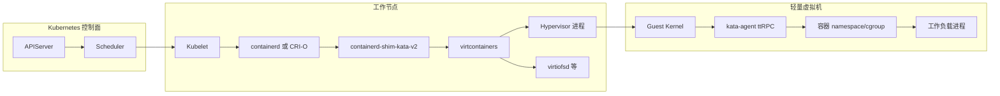
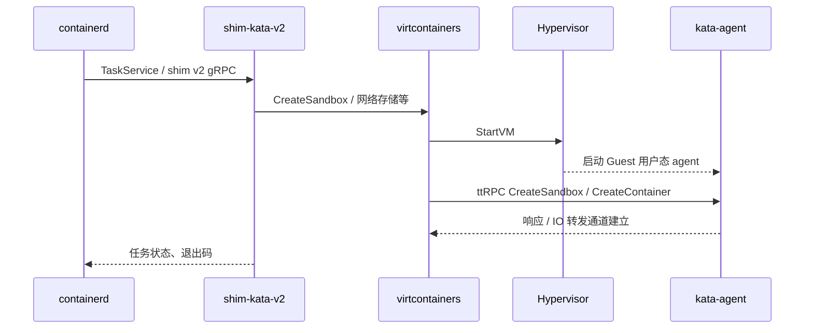
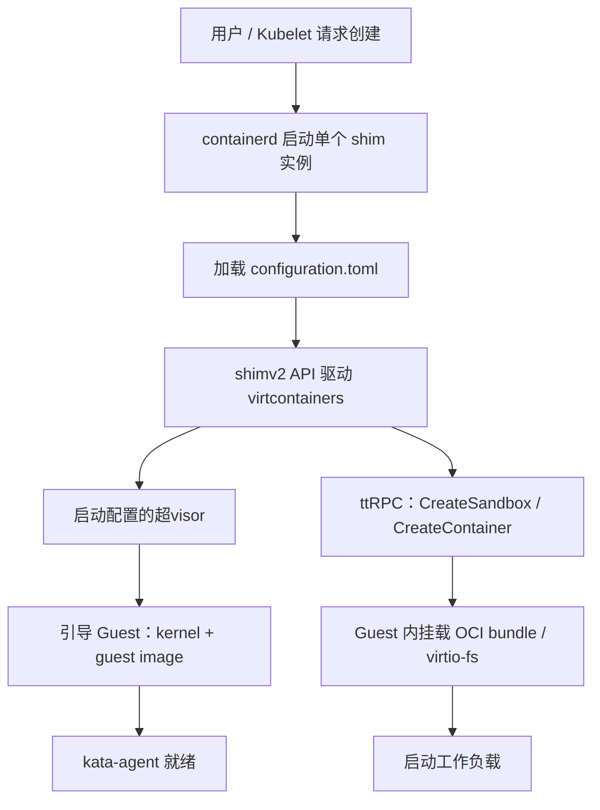
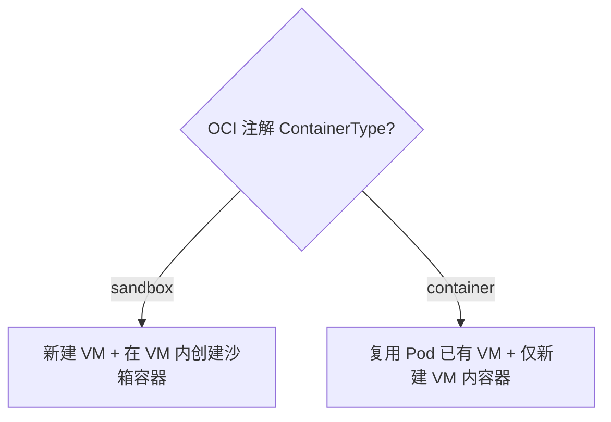
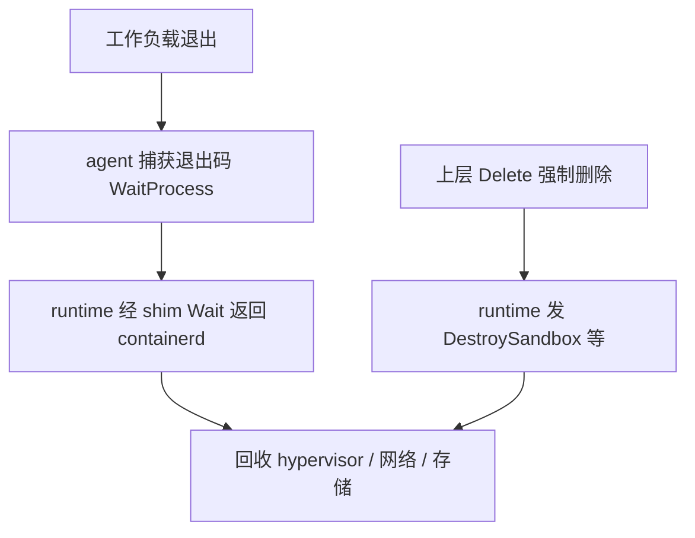
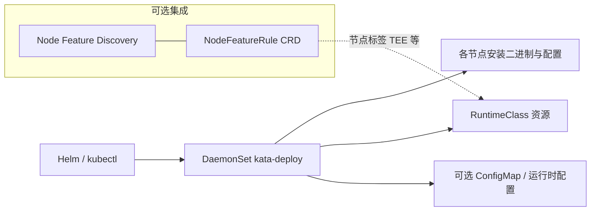

# 流转图（Mermaid）

以下图表用于面试讲解与排障时「对齐心智模型」。细节以 `docs/design/architecture/` 为准。

## 1. 总体：CRI → Shim → VM → Agent

## 2. Shim v2 调用关系（逻辑）

## 3. 容器创建（高层步骤）

## 4. Sandbox vs Pod 内容器（CRI-O 注解语义）

对应官方文档中的决策表：`sandbox` → 创建 VM 与容器；`container` → 不新建 VM，仅在已有 VM 中加容器。

## 5. 关停路径（简化）

若启用 agent tracing，关闭行为可能有额外阶段（见 `docs/tracing.md`）。

## 6. kata-deploy 在集群中的角色（安装视角）

